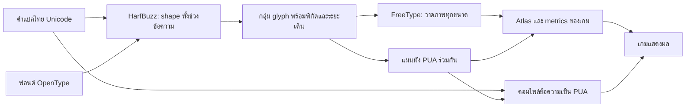

# คู่มือม็อดฟอนต์ไทยสำหรับเกมเก่า

บันทึกจากการทำม็อด Splinter Cell Chaos Theory โดยใช้ Chakra Petch, HarfBuzz,
FreeType และ PUA อัปเดต 3 ตุลาคม 2026

สถานะปัจจุบันของโปรเจกต์คือ `1.0.0-rc1` ใช้ 571 PUA clusters และฟอนต์ Magma 6 ขนาด
รายละเอียดตรวจคำแปล/แพ็กอยู่ใน [RELEASE_READINESS.md](RELEASE_READINESS.md)
ตัวเลขและภาพทดลองที่ระบุวันเก่าในเอกสารนี้เป็นประวัติของบิลด์นั้น

เอกสารนี้อธิบายหลักการที่นำไปทดลองกับเกมอื่นได้ พร้อมระบุส่วนที่ต้องตรวจใหม่
เมื่อเปลี่ยนเกม รายละเอียดบิลด์ของโปรเจกต์นี้อยู่ใน [FONT_PIPELINE.md](../FONT_PIPELINE.md)

## 1. แนวคิดที่ทำให้เกมเก่าแสดงไทยได้

ให้เครื่องมือภายนอกจัดรูปอักษรไทยให้เสร็จตอนสร้างม็อด แล้วให้เกมวาดผลลัพธ์นั้น
วิธีที่ใช้ในโปรเจกต์นี้คือ **offline shaping + bitmap ของกลุ่มอักษร + PUA remapping**

| ส่วน | หน้าที่ |
|---|---|
| ฟอนต์ OpenType เช่น Chakra Petch | ให้รูปอักษรและกฎการเลือกรูป/จัดวาง |
| HarfBuzz | แปลงข้อความเป็น glyph IDs, ระยะเดิน และ offsets ตามบริบท |
| FreeType | วาด glyph IDs เป็นภาพที่ขนาดพิกเซลที่ต้องการ |
| ตัวสร้าง atlas | รวมภาพกลุ่มอักษรลงภาพฟอนต์และเขียน metrics/lookup ของเกม |
| ตัวคอมไพล์ภาษา | เปลี่ยนช่วงข้อความไทยเป็นรหัสที่เรียกภาพกลุ่มอักษร |
| เกม | อ่านรหัส ค้นหา glyph และวาดตาม metrics ที่เตรียมไว้ |

GPOS กำหนดการจัดตำแหน่ง ส่วน GSUB กำหนดการแทนรูป glyph; HarfBuzz ใช้กฎ
ตาม script และ features ของฟอนต์ การอ่าน anchor ใน GPOS เพียงอย่างเดียวจึงยัง
ไม่ครอบคลุมการเปลี่ยนรูปหรือการจัดข้อความทั้งหมด
[อ้างอิง OpenType features ของ HarfBuzz](https://harfbuzz.github.io/shaping-opentype-features.html)

คำว่า “สร้างฟอนต์ PUA” ในกรณีนี้หมายถึงเพิ่ม **ภาพและตารางรหัสในฟอนต์ bitmap ของเกม**
เราไม่ได้สร้าง TTF ใหม่ให้เกมอ่าน GPOS และไม่ได้เพิ่ม HarfBuzz เข้าโปรแกรมเกม



## 2. ตรวจระบบของเกมก่อนเลือกวิธี

สำรองไฟล์ต้นฉบับและตั้งจุดย้อนกลับก่อนทดลอง แยกปัญหาเป็นสี่ชั้น:
**ไฟล์ที่เกมโหลด → encoding → lookup/รูป glyph → ตำแหน่งและ layout**

อย่าเริ่มด้วยการเปลี่ยน TTF แล้วสรุปว่าเกมใช้ฟอนต์นั้น เกมหนึ่งอาจมีทั้งฟอนต์เมนู
ฟอนต์ HUD ฟอนต์คำบรรยาย ภาพข้อความ และฟอนต์หลายขนาดอยู่พร้อมกัน

| สิ่งที่ต้องหา | วิธีทดลอง | สิ่งที่ผลทดลองบอกได้ |
|---|---|---|
| ไฟล์ภาษาที่โหลดจริง | เปลี่ยนหนึ่ง label เป็น ASCII ที่จำได้ง่าย | ข้อความเปลี่ยนจึงยืนยันเส้นทางไฟล์นั้น |
| ฟอนต์และขนาดที่โหลดจริง | เปลี่ยนภาพอักษร Latin หนึ่งช่องให้จำได้ โดยเก็บ metrics เดิม | ถ้าอักษรยังเดิม ให้ตรวจอีกขนาด/อีกระบบ/ไฟล์ที่มีลำดับโหลดสูงกว่า |
| Encoding ที่ parser รับ | ทดสอบไฟล์เล็กแบบ ASCII และ encoding ที่ต้องการทีละแบบ | อ่าน ASCII ได้ยังไม่พิสูจน์ว่าอ่านไทยหรือ PUA ได้ |
| Lookup ที่ renderer รับ | เพิ่มรหัสทดลองพร้อมภาพ glyph และแก้ข้อความให้เรียกรหัสนั้น | ต้องตรวจทั้ง decoder, lookup และ atlas ร่วมกัน |
| การรองรับ shaping | ทดลองพยัญชนะพร้อมสระ/วรรณยุกต์หลายแบบ | ไทยปรากฏแล้วแต่เครื่องหมายผิดยังเป็นปัญหาการจัดวาง |

ใช้ป้ายทดสอบเพียงไม่กี่รายการ อย่าเปลี่ยน encoding, lookup และภาพทั้งหมดพร้อมกัน
เพราะจะระบุสาเหตุไม่ได้ ถอนป้ายและ glyph ทดลองก่อนแพ็กม็อดจริง

### เลือกแนวทางตามข้อจำกัด

| ผลที่ตรวจพบ | แนวทางที่เหมาะจะทดลอง |
|---|---|
| เกมรองรับ Unicode และ OpenType shaping อยู่แล้ว | เพิ่มฟอนต์ไทยที่ครอบคลุม glyph และตรวจ fallback/layout |
| เกมอ่าน Unicode/PUA และเพิ่ม bitmap glyph ได้ แต่ไม่จัดไทย | ใช้ offline shaping และ PUA แบบเอกสารนี้ |
| เกมจำกัดรหัสเป็น 8 บิต | ตรวจการแปลง byte กับช่อง glyph; อาจต้องใช้รหัสแทนในชุดเดิมและจัดสรรช่องอย่างจำกัด |
| ข้อความเป็นภาพตายตัว | แก้ภาพหรือสร้างภาพข้อความตามกระบวนการ asset ของเกม |
| ฟอนต์/encoding เปลี่ยนไม่ได้ หรือข้อความไทยถูกสร้างใหม่ตอนเล่น | อาจต้องแก้ระบบข้อความขณะเกมรัน; offline catalog อย่างเดียวไม่เพียงพอ |

**UTF-16, U+E000 และขนาด atlas 1024 ไม่ใช่ค่าที่ใช้ได้กับทุกเกม**
ทดสอบขอบเขตรหัส จำนวน glyph ขนาด texture รูปแบบภาพ และเครื่องหมายควบคุมของเกมปลายทางก่อน

## 3. Shape ข้อความเต็มบริบท แล้วจึงแยกกลุ่ม

เก็บคำแปลต้นฉบับเป็น Unicode อ่านได้ตามปกติ เช่น JSON UTF-8
แปลงเป็นรหัสแทนเฉพาะผลลัพธ์ที่ส่งให้เกม

ขั้นตอนที่ใช้:

1. แยกข้อความที่ต้อง shape ออกจาก Latin, ตัวแปร และ markup ของเกม
2. ส่งช่วงภาษาไทยทั้งช่วงให้ HarfBuzz พร้อมฟอนต์และค่าที่ชัดเจน:
   script `Thai`, language `th`, direction `ltr`
3. รับ glyph ID, cluster, `x_advance`, `y_advance`, `x_offset`, `y_offset`
4. แบ่งผลลัพธ์ตาม cluster ที่ได้หลัง shaping แล้วรวม glyph ในแต่ละกลุ่มเป็นภาพ
5. เก็บ metrics ของกลุ่มไว้สำหรับตัวเขียนฟอนต์ของเกม

โปรเจกต์นี้ใช้ `MONOTONE_GRAPHEMES` เพื่อรวมเครื่องหมายกับอักษรฐานสำหรับการอบภาพ
cluster ไม่จำเป็นต้องเป็นหนึ่ง code point หนึ่งพยางค์ หรือหนึ่งคำ
และค่าดัชนีต้องตีความตามวิธีเติมข้อความของ binding ที่ใช้ เช่น byte offset หรือดัชนีตัวอักษร
[อ้างอิง HarfBuzz clusters](https://harfbuzz.github.io/working-with-harfbuzz-clusters.html)

**อย่า shape พยัญชนะ สระ และวรรณยุกต์แยกทีละตัวแล้วค่อยมาต่อ**
บริบทอาจมีผลต่อรูป glyph และพิกัด การมีภาพครบทุกตัวไม่ได้หมายความว่าจะประกอบถูก
อย่า rasterize ผ่าน Unicode เดิมอีกครั้งหลัง HarfBuzz เลือก glyph แล้ว;
วาดด้วย glyph ID ที่ได้รับเพื่อรักษาผล GSUB

แผนผังของโปรเจกต์นี้ใช้ key จากทั้งข้อความต้นฉบับของกลุ่มและชุด glyph/positions
จึงแยกกรณีที่ข้อความเหมือนกันแต่ shaping ให้ผลต่างกันได้
ถ้าเปลี่ยนน้ำหนักฟอนต์หรือ OpenType features ให้สร้างผลใหม่และตรวจความสอดคล้องอีกครั้ง

## 4. วาดภาพโดยรักษา baseline, bearing และ advance

ตัวเลขจาก HarfBuzz ในโปรเจกต์นี้อยู่ในหน่วยฟอนต์ โดยตั้ง scale เป็น units-per-em
แปลงเป็นพิกเซลด้วย `pixel_size / units_per_em` ก่อนนำไปใช้กับ bitmap ของ FreeType
หากตั้ง HarfBuzz scale แบบอื่น ต้องใช้หน่วยนั้นให้ตรงกับตัว rasterizer

ตัวอย่างแนวคิดของการวาดแต่ละ glyph ในกลุ่ม:

```text
scale = pixel_size / units_per_em
bitmap_x = round((pen_x + x_offset) * scale) + bitmap_left
bitmap_y = -round((pen_y + y_offset) * scale) - bitmap_top

วาด bitmap ที่ (bitmap_x, bitmap_y)
pen_x += x_advance
pen_y += y_advance
```

ตัวอย่างนี้ใช้แกน Y ของภาพที่เพิ่มลงด้านล่าง จึงกลับเครื่องหมายจากพิกัดฟอนต์
เกมปลายทางอาจใช้สูตร baseline/offset ต่างกัน ต้องมี adapter แปลง metrics ให้ตรงรูปแบบเกม

| ค่า | ความหมาย | ข้อผิดพลาดที่พบบ่อย |
|---|---|---|
| Width / height | ขอบเขตภาพหมึกหลัง crop | ใช้เป็นระยะเดินทั้งหมด ทำให้ช่องไฟผิด |
| Bearing / offset | ตำแหน่งภาพเทียบกับ origin และ baseline | crop แล้วลืมเก็บตำแหน่งเดิม ทำให้สระเลื่อน |
| Advance | ระยะเลื่อน pen ก่อนวาดกลุ่มต่อไป | วรรณยุกต์มีความกว้างภาพแต่ไม่ควรเพิ่มระยะเดินเหมือนพยัญชนะ |
| Line height | ระยะ baseline ระหว่างบรรทัด | ต่ำเกินไปทำให้เครื่องหมายบน/ล่างถูกตัดหรือชน |

คำนวณขอบเขตภาพจาก bitmap ที่วาดจริง แล้วเก็บจุดที่ crop ไว้
เหลือ padding ระหว่าง glyph ใน atlas เพื่อช่วยลดภาพข้างเคียงปนเมื่อมีการกรอง texture
ตรวจ pitch, row order, alpha/palette และการปัดเศษของ rasterizer ด้วย

ควรวาดใหม่ที่แต่ละขนาดเป้าหมาย แทนการขยายภาพขนาดเล็กไปใช้กับทุกความละเอียด
ความสูงภาพกับขนาดฟอนต์ในชื่อไฟล์ไม่จำเป็นต้องเท่ากัน
นอกจากนี้ letter spacing, การสเกล และการปัดเศษของเกมยังมีผลต่อข้อความทั้งบรรทัด
แม้ตำแหน่งภายในกลุ่มจะมาจาก HarfBuzz แล้วก็ตาม

## 5. จัดรหัส PUA และบิลด์ข้อความกับฟอนต์เป็นชุดเดียว

PUA เป็นพื้นที่รหัสที่กำหนดความหมายกันเอง ใน BMP มีช่วง U+E000–U+F8FF รวม 6,400 ช่อง
รหัสหนึ่งช่องอาจแทนภาพกลุ่มอักษรหลายตัวได้ ความหมายต้องตรงกันระหว่างข้อความกับฟอนต์
[อ้างอิง Unicode Private Use FAQ](https://www.unicode.org/faq/private_use.html)

ตัวอย่างเพื่ออธิบายแนวคิดเท่านั้น:

```text
ต้นฉบับ:       ปิด
กลุ่มหลัง shape: [ป + ิ ที่จัดรูป/ตำแหน่งแล้ว] [ด]
ข้อความในเกม:  [PUA_A] [PUA_B]
ฟอนต์ของเกม:   PUA_A -> ภาพกลุ่มแรก, PUA_B -> ภาพกลุ่มที่สอง
```

`PUA_A` และ `PUA_B` ไม่ใช่รหัสคงที่ของคำเหล่านี้ในโปรเจกต์
การจัดรหัสจริงขึ้นกับ catalog; ไม่ใช่มาตรฐานอักษรไทยสำเร็จรูป

แนวทางจัดการ catalog:

- รวบรวมกลุ่มจากคำแปลที่ใช้จริง แล้วเรียงอย่างแน่นอนก่อนกำหนดรหัส
- ใช้ catalog เดียวกันสำหรับ localization และฟอนต์ทุกขนาดที่เกี่ยวข้อง
- เก็บ manifest: รหัส, ข้อความต้นฉบับ, glyph IDs/positions, hash ฟอนต์ และเวอร์ชัน shaping engine
- ตรวจ `decode(encode(text)) == text` และทุกรหัสในผลลัพธ์มี glyph ในฟอนต์ทุกขนาด
- เมื่อเพิ่มคำแปล บิลด์ข้อความและฟอนต์พร้อมกัน; deterministic ไม่ได้แปลว่ารหัสเดิมจะไม่เปลี่ยนเมื่อ catalog เพิ่ม
- ถ้าต้องการอัปเดตเฉพาะบางไฟล์โดยรักษารหัสเดิม ให้ใช้ catalog แบบเพิ่มรายการต่อท้ายและกำหนดรุ่นอย่างชัดเจน

พื้นที่รหัสอาจยังเหลือ แต่ atlas หรือจำนวน record อาจเต็มก่อน
เมื่อเต็มให้ประเมินการแพ็กภาพ เพิ่มหน้า atlas ถ้าเกมรองรับ หรือแบ่ง catalog ตามระบบข้อความ
ห้ามเปลี่ยนไปใช้รหัสเกินขอบเขตที่ parser/renderer รองรับโดยยังไม่ได้ทดสอบ

## 6. ดัดแปลงฟอนต์และ archive ของเกม

การเพิ่มภาพอย่างเดียวไม่พอ ต้องเชื่อมรหัสข้อความกับ glyph index และ metrics ด้วย
ตรวจทั้ง header/count, records, lookup, texture dimensions และชื่อไฟล์ที่โหลดจริง

รักษาภาพและ metrics ของอักษรเดิม โดยเฉพาะ Latin, ตัวเลข, punctuation และสัญลักษณ์ปุ่ม
atlas หน้าสุดท้ายอาจยังมีอักษรใช้งานอยู่ จึงไม่ควรสมมุติว่าเป็นพื้นที่ว่าง

ถ้าขยาย atlas โดยเก็บภาพเดิมที่ตำแหน่งพิกเซลเดิม ต้องปรับ normalized UV:

```text
u_new = u_old * old_width / new_width
v_new = v_old * old_height / new_height
```

สูตรนี้ใช้กับ UV ที่เป็นสัดส่วน 0–1 ของภาพเท่านั้น
ถ้ารูปแบบไฟล์ฝังหมายเลขหน้า texture ในค่า UV ต้องแยกหมายเลขหน้าออกก่อนคำนวณ
และตรวจ pixel-center convention ของเกมด้วย

บาง archive repacker แทนที่รายการเดิมได้แต่เพิ่มชื่อไฟล์ใหม่ไม่ได้
ในกรณีนั้นต้องใช้หน้าภาพเดิมที่ขยายได้ หรือปรับตัวแพ็กให้รองรับรายการใหม่
ตรวจลำดับโหลดระหว่างไฟล์ loose, archive, cache และ resource ของแต่ละภาษา
ปิดเกมก่อนแทนที่ไฟล์ที่เกมเปิดใช้อยู่ และตรวจว่าไฟล์ที่ติดตั้งตรงกับผลบิลด์

## 7. รายละเอียดเฉพาะ Chaos Theory ที่ต้องไม่คัดลอกไปใช้ตรง ๆ

ข้อมูลต่อไปนี้อ้างอิงโค้ดและการทดลองของโปรเจกต์นี้:

| รายการ | สิ่งที่ใช้ได้ในโปรเจกต์นี้ |
|---|---|
| ฟอนต์เมนู | Magma: `.mft` metrics/lookup และ `.tga` bitmap |
| ฟอนต์อีกระบบ | PCX มี palette และช่องอักษรของตัวเอง ยังไม่ได้ใช้ PUA shaping แบบ Magma |
| MFT header | 90 bytes; glyph count uint16 ที่ offset 88 |
| Glyph record | 23 bytes, `struct.Struct("<HBBbbB4f")` |
| Unicode lookup | 256 pages; flag หนึ่ง byte; page ที่มีตามด้วย 256 uint16 glyph indices |
| ภาพที่เขียน | TGA grayscale 8-bit, uncompressed, top-left origin |
| วิธีเพิ่มภาพ | ขยายหน้าสุดท้ายเป็น 1024×1024 และปรับ UV ของภาพเดิม |
| ฟอนต์ที่ต้องครอบคลุม | Bios 20/32/48 และ Prototype 13/26/36 |
| ขนาด rasterize ตามลำดับข้างบน | 15/24/36 และ 11/22/30 pixels |
| ข้อความ UI ที่เลือก | UTF-16LE พร้อม BOM และ PUA เริ่ม U+E000 |
| ข้อความอีกเส้นทาง | ยังใช้ CP874 กับ PCX; การปรากฏของไทยไม่ได้พิสูจน์ว่าจัดวางถูกทั้งหมด |

ค่าความกว้าง/สูง/advance ของ record นี้มีพื้นที่เพียง byte และ bearings เป็น signed byte
ภาพใหญ่หรือ offsets เกินช่วงจะต้องถูกตรวจจับก่อนเขียน
ไฟล์ชื่อ `.mft` จากเกมอื่นก็อาจมี layout ต่างกัน แม้ใช้ชื่อระบบฟอนต์คล้ายกัน

### บทเรียนจากการทดสอบจริง

บิลด์แรกเพิ่มไทยเฉพาะ Bios 20 และ Prototype 13 ผลที่ 1920×1080 คือ label ไทยว่าง
ASCII ในไฟล์ UTF-16 ยังแสดงได้ ส่วน glyph Latin ที่ใช้ทดสอบในสองฟอนต์นั้นไม่เปลี่ยนตามการแก้
จึงตรวจฟอนต์ขนาดอื่นต่อ แทนที่จะสรุปว่าเกมไม่รองรับ Unicode

หลังเพิ่ม catalog เดียวกันให้ครบทั้งหกขนาด เมนูเลือกโหมด เมนูหลัก และตั้งค่าทั้งสามแท็บ
แสดงไทยได้ ดู [รายงานและภาพจากเกมจริง](../out/game-test/REPORT.md)
ผลนี้ยืนยันเฉพาะหน้าที่ตรวจในเกมเวอร์ชัน 1.05 ที่ 1920×1080
HUD, OPSAT, คำบรรยาย และความละเอียดอื่นยังไม่ได้รับการตรวจด้วยภาพในรอบนั้น

## 8. ข้อจำกัดที่ต้องจัดการเมื่อใช้กับเกมอื่น

**การตัดบรรทัด:** รหัส PUA ไม่ได้เก็บคุณสมบัติการแบ่งคำภาษาไทยแบบข้อความเดิม
เกมอาจตัดได้ทุกกลุ่ม ไม่ตัดเลย หรือใช้จำนวนตัวอักษรแทนความกว้าง
ถ้าต้องจัดบรรทัดล่วงหน้า ให้แบ่งคำบน Unicode ต้นฉบับ วัดด้วย metrics เป้าหมาย
แล้ว shape/encode บรรทัดสุดท้ายอีกครั้งเพื่อรักษาบริบทหลังการแบ่ง

**ข้อความที่เกิดขณะเล่น:** ชื่อที่ผู้เล่นพิมพ์ แชต และข้อความจากภายนอกอาจไม่มีอยู่ใน catalog
วิธีนี้ครอบคลุมข้อความที่เตรียมไว้และกลุ่มที่รวบรวมได้เท่านั้น
ตัวแปรที่แทนด้วยข้อความไทยใหม่ รวมถึงรอยต่อระหว่างชิ้นข้อความ ต้องมีวิธีจัดการเพิ่มเติม

**Markup และตัวแปร:** รักษา `%s`, `%d`, `{name}`, `<KEY>`, tags สี และ escape sequences
ตามรูปแบบเกม การใช้ regex จับภาษาไทยอย่างเดียวเหมาะกับข้อความเรียบง่ายในโปรเจกต์นี้
สำหรับเกมที่มี markup ซับซ้อนควร parse token ก่อน shape
tag ที่คั่นกลางอักษรฐานกับเครื่องหมายอาจทำให้กลุ่มขาด ต้องกำหนดวิธีรองรับอย่างชัดเจน

**การค้นหา/คัดลอก/แก้ไขข้อความ:** สตริง PUA ไม่ใช่ Unicode ไทยเดิม
หากเกมต้องค้นหา เรียงชื่อ หรือให้ผู้เล่นเลื่อน caret ควรเก็บข้อความ logical แยกจากข้อความแสดงผล
และมีแผนผังกลับ การรวมหลายตัวอักษรเป็นหนึ่ง glyph มีผลต่อการนับความยาวและการพิมพ์ทีละตัว

**ภาษาอื่น:** อย่าใช้การแบ่ง Thai run หรือกฎ ltr นี้กับทุกภาษา
ภาษา RTL การเชื่อมอักษรข้ามกลุ่ม และการเปลี่ยนรูปตามบรรทัดอาจต้องใช้รูปแบบการอบภาพอีกแบบ

**ขนาดและรูปแบบฟอนต์:** ฟอนต์ต่างน้ำหนักอาจให้ glyph IDs และ metrics ต่างกัน
ทดสอบทุก style/scale/fallback ที่เกมใช้ และเก็บข้อมูลฟอนต์กับแผนผังให้ตรงรุ่น
ก่อนแจกม็อด เก็บไฟล์ license ของฟอนต์ที่นำมาใช้และตรวจเงื่อนไขการแจก/ดัดแปลงจากต้นฉบับ

## 9. วิธีทดสอบและวิเคราะห์อาการ

ใช้ทั้งตัวตรวจไฟล์ ตัวพรีวิวที่อ่านฟอนต์ผลลัพธ์จริง และเกมจริง
ตัวพรีวิวสวยยังไม่ยืนยันว่าเกมโหลดไฟล์นั้น หรือแปล offsets เหมือนกัน

### การตรวจอัตโนมัติที่มีประโยชน์

- ทุกข้อความ encode/decode กลับได้ตรงต้นฉบับ รวม whitespace, placeholders และ tags
- ทุกรหัสผลลัพธ์มี lookup และ record ที่ถูกต้องในฟอนต์ทุกขนาด
- Glyph ID 0, ภาพว่าง, atlas overflow และค่า metrics เกินขอบเขตต้องทำให้บิลด์ล้มเหลว
- Crop ภาพ Latin เดิมกลับมาเทียบพิกเซลและ metrics หลังแก้ atlas
- ตรวจภาพและ metrics ของ PUA ที่แพ็กแล้วเทียบกับผล rasterize ก่อนแพ็ก
- ทดลองข้อความหลายกรณี: `กิ`, `กี่`, `ปิ`, `ปู่`, `น้ำ`, `ญู`, `ฎุ`, `ฏู`, `ตั้งค่า`, `ผู้สร้าง`
- ตรวจความกว้างข้อความหลายกลุ่มและข้อความผสม Thai/Latin เทียบกับผลที่คาดไว้
- ตรวจ archive ที่แพ็กเสร็จอีกครั้ง และ hash ของไฟล์ที่ติดตั้งกับไฟล์บิลด์

การเทียบภาพกับ rasterizer เดียวกันตรวจได้ว่าการแพ็กไม่ทำผลเสีย
แต่ยังต้องดูข้อความจริงเพื่อยืนยันคุณภาพการจัดวางและพฤติกรรม renderer ของเกม

| อาการ | จุดที่ควรตรวจเป็นลำดับแรก |
|---|---|
| อักษรมั่วเป็น Latin | decoder/encoding, byte-to-codepoint mapping และไฟล์ภาษาที่โหลด |
| ไทยหรือ PUA ว่าง แต่ ASCII ปรากฏ | ฟอนต์/ขนาดที่โหลดจริง, lookup page และภาพ atlas |
| ตัวสี่เหลี่ยม | glyph หาย, fallback font หรือ lookup ชี้ผิด |
| ไทยอ่านได้ แต่เครื่องหมายลอย | shaping context, glyph IDs, baseline, bearings และ advance |
| คำใหม่อ่านผิดหลังอัปเดต | catalog ของ localization กับฟอนต์คนละรุ่น |
| i/j หรือเครื่องหมายอังกฤษเสีย | ภาพเดิมถูกทับหรือ UV หลังขยาย atlas ผิด |
| ถูกที่ความละเอียดหนึ่ง แต่ผิดอีกความละเอียด | ฟอนต์อีกขนาด/อีกหน้า texture หรือการสเกล |
| ภาพกลับหัว/สีผิด/กล่องดำ | origin, pixel format, palette, alpha และ texture format |
| ข้อความถูก แต่ล้นหรือตัดคำผิด | advance, line height, letter spacing และวิธีตัดบรรทัด |

### เกณฑ์ผ่านในเกมจริง

เปิดหน้าที่ใช้ฟอนต์แต่ละระบบและแต่ละขนาด ตรวจสถานะปกติ/เลือก/ปิดใช้งาน
ข้อความสั้น/ยาว/หลายบรรทัด กล่องยืนยัน รายการเลื่อน และข้อความมีตัวเลขหรือชื่อปุ่ม
ตรวจสระบน สระล่าง วรรณยุกต์ซ้อน ตัวมีหาง และการนำทางหลังเปลี่ยนข้อความ
บันทึก game version, ความละเอียด, build/catalog version และภาพหลักฐาน
ระบุหน้าที่ยังไม่ได้ตรวจแยกจากหน้าที่ผ่าน

## 10. ส่วนที่นำไปใช้ต่อได้จากโปรเจกต์นี้

| ไฟล์ | สิ่งที่นำไปศึกษา/ดัดแปลง |
|---|---|
| [thai_shaper.py](../src/core/thai_shaper.py) | Shaping, catalog, encode/decode และ rasterize glyph IDs |
| [magma_builder.py](../src/pipeline/magma_builder.py) | ตัวอย่าง adapter ของ font format, atlas preservation และ lookup writer |
| [compiler.py](../src/pipeline/compiler.py) | แปลงคำแปลเฉพาะ output และเลือก encoding ตามระบบข้อความ |
| [preview_magma.py](../tools/preview_magma.py) | พรีวิวจาก metrics/atlas ที่สร้างจริง |
| [test_thai_shaping.py](../tests/test_thai_shaping.py) | ตัวอย่างตรวจ round trip, lookup, Latin preservation และ PUA pixels |

เมื่อนำไปเกมอื่น ให้เก็บส่วน **shape/catalog/render** แล้วเปลี่ยนส่วน
**อ่าน/เขียนฟอนต์, metrics adapter, encoding และ archive** ให้ตรงเกมนั้น
เพิ่มข้อมูลฟอนต์ทุกขนาด ตรวจหนึ่ง label ในเกมให้สำเร็จก่อนขยายไปทั้งคลังคำแปล

คำสั่งอ้างอิงของ Chaos Theory:

```powershell
python -m pip install -r requirements.txt
python build.py
python -m unittest discover -s tests -v
python tools/preview_magma.py
python src/cli.py install
```

คำสั่ง `install` ของโปรเจกต์นี้ติดตั้งตาม `config.json` ของ Chaos Theory
ต้องเปลี่ยนตัวติดตั้งและเส้นทางก่อนใช้กับเกมอื่น

แหล่งอ่านโครงสร้าง lookup ที่ใช้ประกอบการแกะ MFT:
[FC2MFTConverter / MFTFormat.cs](https://github.com/eprilx/FC2MFTConverter/blob/master/FC2MFTConverter/MFT/MFTFormat.cs)
ใช้อ้างอิงประกอบการเปรียบเทียบ; record layout ของ Chaos Theory ต่างจาก Far Cry 2
